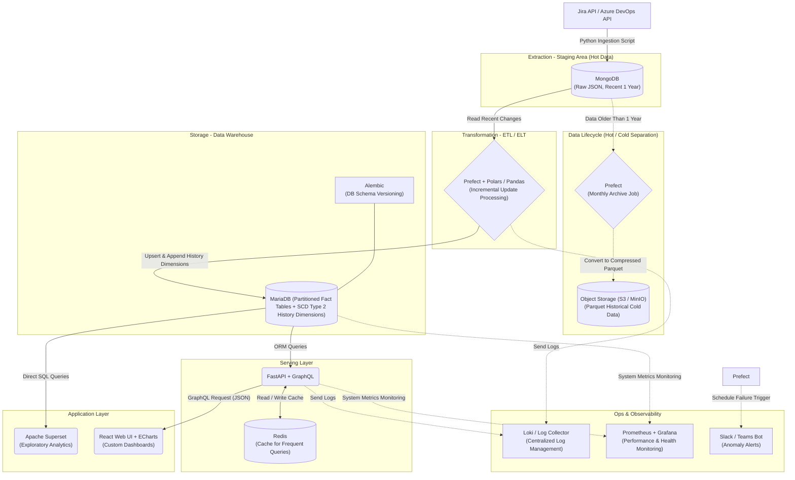

```mermaid
flowchart TD
    %% Node Definitions
    DataSource["Jira API / Azure DevOps API"]

    subgraph StagingLayer ["Extraction - Staging Area (Hot Data)"]
        MongoDB[("MongoDB<br>(Raw JSON, Recent 1 Year)")]
    end

    subgraph ColdStorageLayer ["Data Lifecycle (Hot / Cold Separation)"]
        ArchiveJob{"Prefect<br>(Monthly Archive Job)"}
        S3[("Object Storage (S3 / MinIO)<br>(Parquet Historical Cold Data)")]
    end

    subgraph ETLLayer ["Transformation - ETL / ELT"]
        Processor{"Prefect + Polars / Pandas<br>(Incremental Update Processing)"}
    end

    subgraph DWHLayer ["Storage - Data Warehouse"]
        MariaDB[("MariaDB (Partitioned Fact Tables + SCD Type 2 History Dimensions)")]
        Migration["Alembic<br>(DB Schema Versioning)"] --- MariaDB
    end

    subgraph ServingLayer ["Serving Layer"]
        FastAPI("FastAPI + GraphQL")
        Redis[("Redis<br>(Cache for Frequent Queries)")]
    end

    subgraph AppLayer ["Application Layer"]
        Superset("Apache Superset<br>(Exploratory Analytics)")
        React("React Web UI + ECharts<br>(Custom Dashboards)")
    end

    subgraph OpsLayer ["Ops & Observability"]
        LogCenter["Loki / Log Collector<br>(Centralized Log Management)"]
        Monitor["Prometheus + Grafana<br>(Performance & Health Monitoring)"]
        Alert["Slack / Teams Bot<br>(Anomaly Alerts)"]
    end

    %% Data Flow (Hot Data - Main Path)
    DataSource -- "Python Ingestion Script" --> MongoDB
    MongoDB -- "Read Recent Changes" --> Processor
    Processor -- "Upsert & Append History Dimensions" --> MariaDB

    %% Data Flow (Cold Data - Archive Path)
    MongoDB -. "Data Older Than 1 Year" .-> ArchiveJob
    ArchiveJob -. "Convert to Compressed Parquet" .-> S3

    MariaDB -- "Direct SQL Queries" --> Superset
    MariaDB -- "ORM Queries" --> FastAPI

    FastAPI -- "Read / Write Cache" <--> Redis
    FastAPI -- "GraphQL Request (JSON)" --> React

    %% Monitoring Flow
    Processor -.->|Send Logs| LogCenter
    FastAPI -.->|Send Logs| LogCenter
    Prefect -.->|Schedule Failure Trigger| Alert
    MariaDB & FastAPI -.->|System Metrics Monitoring| Monitor
```
